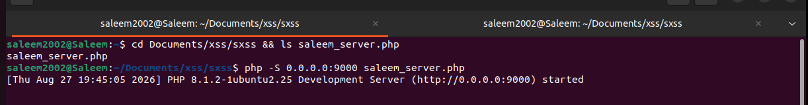
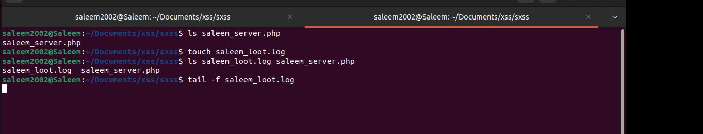

# Project – Cross-Site Scripting (XSS) Web Security Testing Lab

---

## Overview

This project demonstrates the creation of a controlled **Cross-Site Scripting (XSS) testing environment** to gain hands-on experience with web application security, browser-side JavaScript execution, HTTP callbacks, and real-time server monitoring.

I configured an Ubuntu-based PHP server to act as a controlled listener and prepared logging functionality to determine whether JavaScript supplied through a web application's user-controlled input could execute in the browser and initiate a request back to my testing environment.

The original exercise explored how an XSS vulnerability could potentially expose browser/session information. Testing was performed only against websites for which I had permission to conduct security testing.

Although the testing infrastructure was successfully configured, the applications tested did **not** execute the attempted XSS in a manner that generated the expected callback. Therefore, **no exploitable XSS vulnerability was confirmed and no session information was obtained**.

The project was retained and documented because negative findings are also an important part of security testing: the objective of testing is to determine whether a vulnerability exists, not to assume exploitation will succeed.

---

## Environment

| Tool / Technology | Purpose |
|------|---------|
| Ubuntu Linux | Web security testing environment |
| PHP 8.1 | Hosted the local testing/listener server |
| PHP Development Server | Provided an HTTP endpoint on port 9000 |
| JavaScript | Used to understand browser-side XSS execution |
| HTTP | Browser-to-listener communication |
| Bash / Terminal | Server configuration and monitoring |
| `tail -f` | Real-time monitoring of the callback log |
| GitHub | Project documentation and evidence |

---

## Lab Architecture

The testing environment consisted of two primary components:

### Web Application

An authorized web application was used to test whether user-controlled input could be interpreted by the browser as executable JavaScript.

### Controlled Listener

An Ubuntu system hosted a PHP-based listener designed to observe HTTP callbacks generated during testing.

The basic testing flow was:

**Web Input → Browser Processes Input → JavaScript Execution Test → HTTP Callback → PHP Listener → Log File**

If the supplied input executed as JavaScript and generated the expected request, the controlled listener would receive the callback and the activity could be observed in the log.

---

# Lab Setup & Testing

---

## 🟢 Step 1 – Local PHP Testing Server

The first stage of the lab involved preparing a local server that could receive HTTP requests generated during testing.

I navigated to the project directory:

`~/Documents/xss/sxss`

The directory contained the PHP listener script:

`saleem_server.php`

I then started a PHP development server listening on all interfaces on **port 9000**.

The terminal confirmed:

`PHP 8.1.2 Development Server (http://0.0.0.0:9000) started`

*Ubuntu terminal showing the PHP listener successfully started on `0.0.0.0:9000` using `saleem_server.php`.*

### Security Concept

The listener represents the controlled receiving system in the experiment.

If browser-side JavaScript successfully generated an HTTP request during authorized testing, the request would be directed toward this server where it could be observed and analyzed.

---

## 🔵 Step 2 – Callback Logging & Real-Time Monitoring

After preparing the PHP server, I configured logging so that incoming test activity could be monitored.

A dedicated log file was created:

`saleem_loot.log`

I verified that both the PHP listener and log file existed within the project directory.

I then used:

`tail -f saleem_loot.log`

to continuously monitor the log.

*Ubuntu terminal showing the creation of the callback log and real-time monitoring using `tail -f`.*

### Why `tail -f` Was Used

The `tail -f` command continuously watches a file and displays new entries as they are written.

This made it useful for the lab because any callback reaching the listener could immediately be observed without repeatedly reopening the log file.

---

## 🟠 Step 3 – Authorized XSS Testing

With the listener and monitoring environment prepared, I tested whether user-controlled application input could cause browser-side JavaScript execution.

The original experiment was designed to explore the security impact of XSS on browser session data.

Conceptually, the test attempted to determine whether:

1. User-controlled input was accepted by the application.
2. The application returned that input to a browser.
3. The browser interpreted the supplied input as JavaScript.
4. The JavaScript was allowed to execute.
5. The browser generated an HTTP request to the controlled listener.
6. The listener recorded the callback.

For public documentation, the operational session-data collection payload is intentionally omitted. The same XSS concept can be demonstrated safely using a benign JavaScript action or a callback containing a predetermined test value.

---

# Test Result

## ⚪ No XSS Vulnerability Confirmed

The server and monitoring infrastructure were successfully configured; however, the tested applications did not generate the expected callback.

Therefore:

- **No exploitable XSS vulnerability was confirmed**
- **No session information was obtained**
- No successful unauthorized access occurred
- The test remained an authorized security-testing exercise

This is an important distinction when documenting penetration testing or vulnerability research.

An unsuccessful payload does **not** prove that an application is completely free of XSS vulnerabilities. It only means that the specific testing performed did not confirm the vulnerability.

---

## Analysis of the Negative Result

Several security mechanisms or application behaviors can prevent an XSS attempt from succeeding.

Examples include:

### Input Validation

The application may reject potentially dangerous characters or input patterns before accepting the data.

### Output Encoding

Characters such as `<`, `>`, quotation marks, and other JavaScript-related syntax can be encoded before being rendered by the browser, preventing the input from becoming executable code.

### Content Security Policy (CSP)

A properly configured Content Security Policy can restrict where scripts and other browser resources are allowed to execute or communicate.

### HttpOnly Cookies

Cookies configured with the `HttpOnly` attribute cannot be directly accessed through client-side JavaScript, reducing the impact of certain XSS attacks involving session cookies.

### Application Context

XSS payload behavior depends heavily on where user input is inserted into the page. Input appearing inside HTML, an attribute, JavaScript, or another context can require different handling and defenses.

The negative result reinforced that vulnerability testing requires analyzing **how the application processes input**, not simply submitting a payload and assuming it will execute.

---

## Security Testing Workflow Practiced

The lab followed a basic web-security testing methodology:

**Identify Input → Prepare Controlled Listener → Configure Logging → Submit Test Input → Monitor for Execution/Callback → Analyze Result → Document Finding**

The exercise provided hands-on exposure to both sides of an XSS test:

**Application Side**

Understanding how user-controlled input could potentially become executable browser content.

**Monitoring Side**

Understanding how a controlled server can be configured to observe browser-generated HTTP callbacks.

---

## Skills Demonstrated

| Skill | How It Was Applied |
|-------|--------------------|
| Web Application Security | Practiced authorized testing for Cross-Site Scripting behavior |
| XSS Concepts | Explored how user-controlled input can potentially become browser-executed JavaScript |
| HTTP Fundamentals | Worked with browser-to-server HTTP communication |
| PHP | Configured a PHP-based local testing/listener environment |
| Linux Administration | Built and operated the lab from an Ubuntu environment |
| Command Line | Managed files, started services, and monitored logs through the terminal |
| Log Monitoring | Used `tail -f` for real-time observation of test activity |
| Security Validation | Determined whether testing produced evidence of an exploitable condition |
| Defensive Security | Examined controls that can mitigate XSS, including encoding, CSP, and HttpOnly |
| Documentation | Recorded the methodology, evidence, and negative result without overstating findings |

---

## Key Findings

### Finding 1 – Listener Infrastructure Successfully Configured

The PHP development server successfully started and listened for HTTP traffic on port `9000`.

This established the controlled receiving component required for the experiment.

### Finding 2 – Real-Time Monitoring Successfully Configured

The callback log was successfully created and monitored using `tail -f`.

This provided a method for immediately identifying whether the testing generated a request to the listener.

### Finding 3 – Exploitation Was Not Confirmed

The authorized applications tested did not produce the expected callback.

As a result, the testing did not provide sufficient evidence to classify the tested behavior as an exploitable XSS vulnerability.

---

## Lessons Learned

**A working test environment does not guarantee a vulnerability.** Successfully configuring the listener and logging infrastructure was separate from determining whether the target application was actually vulnerable.

**Negative findings are still meaningful.** Security testing is about validating or disproving a hypothesis. Documenting that exploitation was not confirmed is more accurate than overstating the result.

**Application defenses matter.** Input validation, contextual output encoding, Content Security Policy, and secure cookie attributes can significantly reduce the likelihood or impact of XSS.

**Understanding the underlying HTTP flow is valuable.** Building the listener helped demonstrate how browser-side activity can result in network requests that are observable by another server.

**Ethical scope is essential.** Web application security testing should only be performed against systems that you own or have explicit authorization to test.

---

## Project Outcome

The project successfully demonstrated:

- Creation of a controlled XSS testing environment
- PHP web server configuration
- HTTP listener setup
- Real-time log monitoring
- Understanding of browser-to-server callbacks
- Authorized web application security testing
- Analysis of an unsuccessful exploitation attempt
- Understanding of common XSS defenses
- Evidence-based vulnerability documentation

Although no exploitable XSS vulnerability was confirmed, the project provided hands-on experience with the methodology and infrastructure involved in basic web application security testing.

---

## References

- [OWASP Cross Site Scripting (XSS)](https://owasp.org/www-community/attacks/xss/)
- [OWASP Cross Site Scripting Prevention Cheat Sheet](https://cheatsheetseries.owasp.org/cheatsheets/Cross_Site_Scripting_Prevention_Cheat_Sheet.html)
- [OWASP Web Security Testing Guide](https://owasp.org/www-project-web-security-testing-guide/)
- [MDN Web Docs – Content Security Policy](https://developer.mozilla.org/en-US/docs/Web/HTTP/CSP)
- [MDN Web Docs – Secure Cookie Configuration](https://developer.mozilla.org/en-US/docs/Web/Security/Practical_implementation_guides/Cookies)

---

## Disclaimer

This project documents an **authorized cybersecurity home-lab and web application security testing exercise**. Testing was performed only against systems for which permission had been obtained.

The project is documented for educational and portfolio purposes. No exploitable XSS vulnerability was confirmed and no unauthorized access or session information was obtained.
